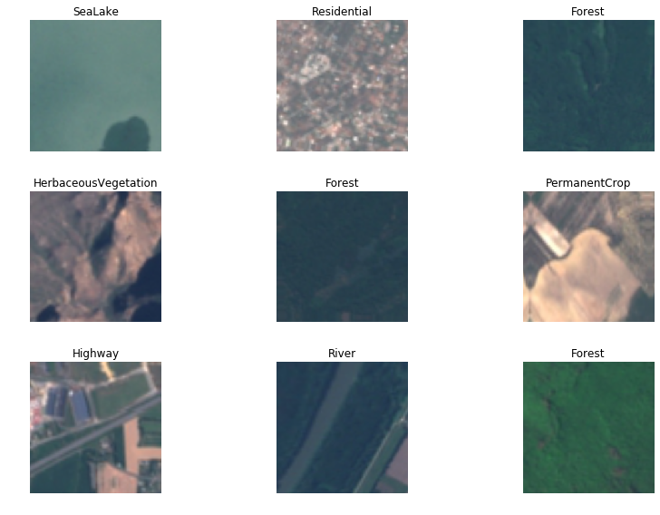
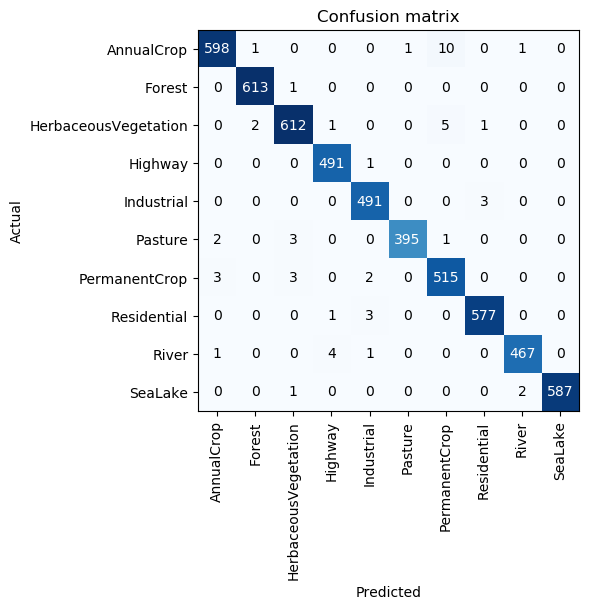
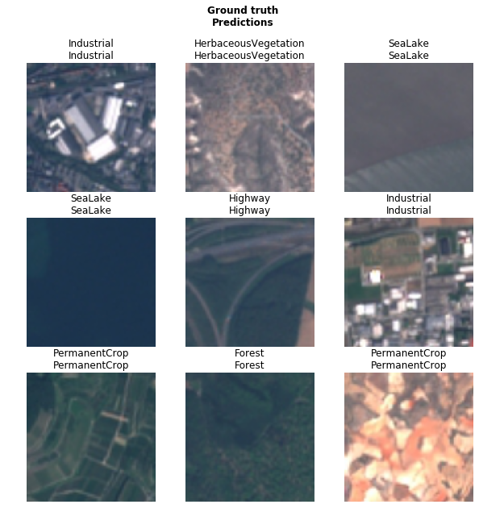

# Land Use and Land Cover Classification (Beating the Benchmark)
 
In this project, we address the challenge of determining the land use and land cover classification of Sentinel-2 satellite images (EuroSAT dataset). The EuroSAT dataset can be downloaded from http://madm.dfki.de/downloads. This dataset is the first large-scale patch-based land use and land cover classification dataset based on Sentinel-2 satellite images and is thanks to the fantastic work of [Helber et al. (2018)](https://arxiv.org/abs/1709.00029).

The ability to classify land use and land cover accurately is important as it can be leveraged for multiple real-world Earth observation applications. Possible applications are land use and land cover change detection or the improvement of geographical maps.

The EuroSAT dataset consists of 27,000 labelled images with 10 different land use and land cover classes. The labelled dataset EuroSAT is made publicly available at https://github.com/phelber/eurosat. Furthermore, Helber et al (2018) benchmark for the proposed EuroSAT dataset using Convolutional Neural Networks (CNNs). The goal of the work is to beat their benchmark.

 The 10 different land use and land cover classes are as follows:

## Model Training 
We implement a transfer learning approach using a pre-trained model `resnet50` that has been pre-trained on ImageNet.
Parameters:
- Model = ResNet50
- Batch Size = 32
- Training/Validation split = 80/20%
- Image Augmentation + normalisation (ImageNet)

## Confusion Matrix 

This gives us a final prediction accuracy of ~**99%** which is a state-of-the-art performance result and beats the current benchmark (Helber et al., 2018) by 0.43%.

## Results

